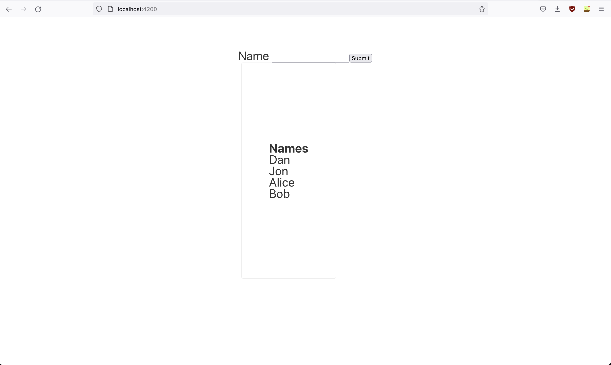

# A Very Simple Spring Boot/Angular Web App

## Introduction

This is just a basic app built with Spring Boot and Angular 13 to teach myself the basics. All it does is it keeps track of a list of names and has a single form that allows users to enter in any name they want. It looks a little something like this:



## How To Run

First, lets start up the backend server. This server runs on `openJDK 17.0.3`. Make sure you have that, Docker, and Maven installed. Then navigate into the `server` folder and run the commands:
````
mvn clean install
docker build -t spring-boot-demo .
docker run -p 8080:8080 spring-boot-demo
````
and the backend server should be running now!

Now, we need to start up the frontend client. Make sure you have `node`, `npm`, and `@angular/cli`
installed. Then navigate into the `client` folder and run the commands:

````
npm install
ng serve --open
````
and now you should see the website fully working at `localhost:4200`!